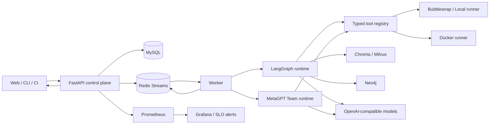
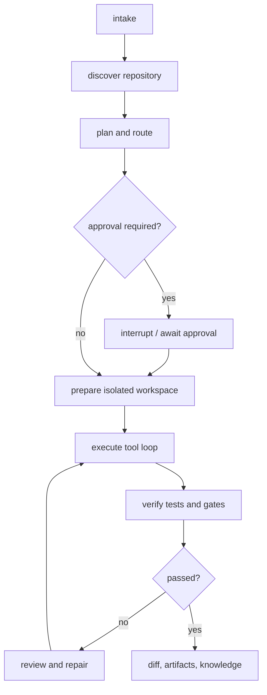

# 系统架构

智效工坊把控制面与执行面分开。Web/CLI 负责输入和审批，API 负责持久化与审计，Worker 调用 Agent Core，工具只在声明的 workspace 中运行。

默认执行面是**单个编码 Agent 的工具循环**（LangGraph `StateGraph` + SQLite checkpointer）。图中的 MetaGPT 仅在 `engine=metagpt` 时启用。Redis Streams 是队列与 SSE 传输层，**不是**图 checkpointer。向量库与图谱是可选索引，不表示百万级召回已上线。

Worker 默认运行 LangGraph；当 `RunJob.engine=metagpt`（或 Agent/仓库显式选择）时走 MetaGPT Team 垂直切片，事件契约与工具权限与 LangGraph 对齐。

执行面默认使用 `bubblewrap`（Linux/Compose）或 Docker runner；`local` 仅用于可信开发，且 `execute/full` 必须显式开启 `ALLOW_UNSANDBOXED_LOCAL_EXECUTION`。Redis Job 经 HMAC 签名；`clone_approved`、`network_capabilities` 与 `ops_capabilities` 彼此独立，避免一次审批解锁多种高危能力。
## 执行状态机

`AgentRuntime` 使用正式 `StateGraph` 节点和 checkpointer；计划审批可中断并以同一 run id 恢复。控制面保存 TaskRun、RunStep、ToolInvocation、Approval 与 Artifact，Redis Stream 使用游标支持多消费者和断线续传。测试门禁或明确的“无法验证”记录是终态的必要证据。

## 模块职责

- `packages/agent_core`：状态机、任务路由、模型适配、权限、Runner、工具、项目指令、Skill、RAG、训练和 CLI/TUI。
- `apps/api`：认证、多租户空间、仓库/运行元数据、审批、事件订阅、上手引导、工作流、Agent、模型、知识图谱、评测与观测 API。
- `apps/worker`：消费任务队列，运行 Agent Core，将事件与结果写回控制面。
- `apps/web`：操作台和运行可视化，不直接访问数据库或 Runner。
- `infra`：独立镜像、Compose、Nginx SSE、Prometheus/Grafana、SLO 告警、数据服务和健康检查。

## 数据与事件

MySQL 是业务记录的事实源；Redis Stream 是运行事件传输层；制品目录保存 diff、测试报告与日志索引。向量与图数据保存知识索引，答案必须携带来源引用。运行事件至少包含事件 id、类型、run id、序号、数据块与终态；客户端通过 `Last-Event-ID` 或 `cursor` 恢复。

## 扩展点

- WorkflowDefinition 是版本化 JSON DSL，草稿经管理员发布后才能执行；TaskRun 固化版本，Worker 按 DSL 动态构建 LangGraph 节点、条件、重试、审批与工具白名单。
- AgentDefinition 保存角色、Prompt 与工具白名单。
- PluginHost 以「万物皆插件」组合运行时：tools、commands、hooks、skills、MCP、prompt 都是同一套贡献点。内置插件提供默认实现；可信工作区的 `.zhixiao/commands`、`hooks.toml`、`skills` 和 `.zhixiao/plugins/*.py` 是同一 seam 的 Provider。消费方（Runtime / slash / TUI）只读取组装后的 Host，不导入具体 Provider。错误配置会失败退出，不会跳过。
- ToolRegistry 统一类型化输入和 ToolResult 输出。
- ModelProfile 采用 OpenAI-compatible 协议，路由层负责超时、回退、成本与 A/B 选择。
- VectorStore 和 GraphStore 是异步抽象，支持内存测试适配器与外部后端。
